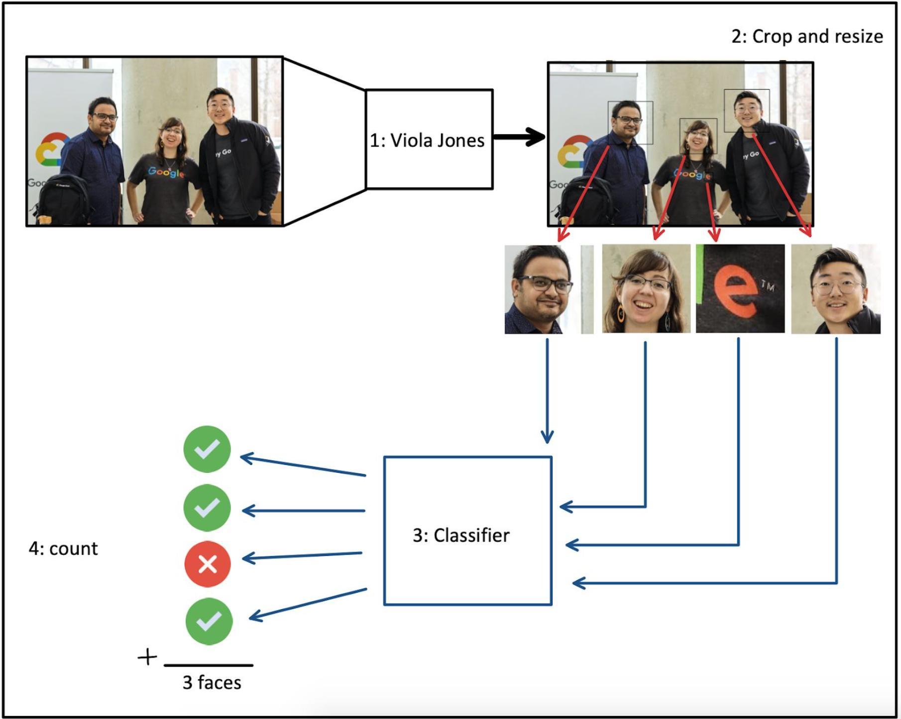
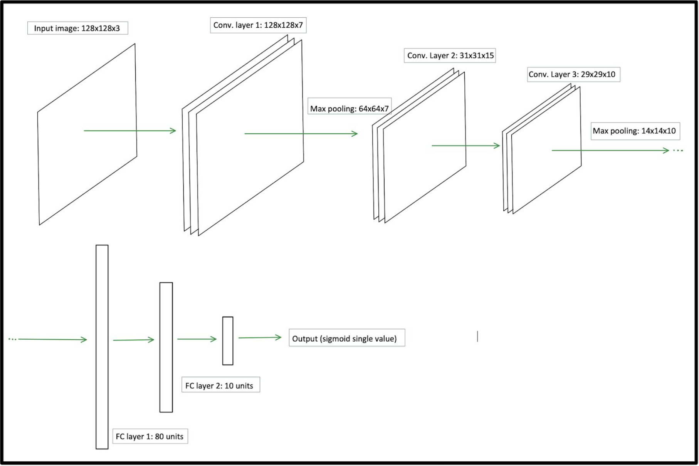
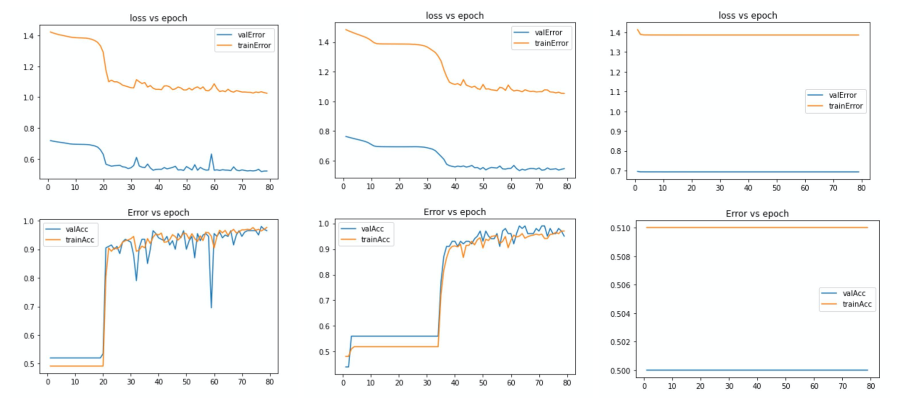
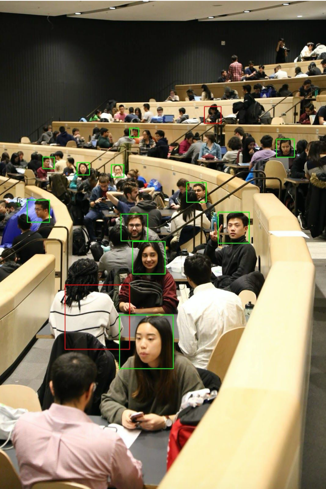

# attention-counter
Harnessing facial detection and CNNs to count attentive people (project for APS360 at the University of Toronto 2020)

## Architecture
Our full system consists of 2 parts. A pre-trained Viola Jones model and a classifier we built from scratch.
Our system first starts with the viola jones algorithm which is implemented using the opencv library. We use this pre-trained model that detects the locations of the faces in an image. However, this algorithm tends to detect a high number of false positives.
Therefore we take each identified box, crop it and resize it to allow it to pass into our classifier. Our classifier then determines which regions are actually faces, which can then be counted up to provide a total. This ensures that false positives are removed, greatly improving the overall performance.
The classifier takes an input of size 128x128 and returns the probability of it being a face. We then use a threshold to give a yes/no answer. The model consists of a CNN with 3 convolutional layers and 2 max pooling layers followed by a 3-layer ANN. The exact dimension reduction and architecture can be seen in figure 6.

## Training our CNN

When we began tuning hyperparameters we noticed sometimes the model had trouble learning, and realized given the time and computation constraints, training on a smaller subset allowed us to better tune the model. This was done while ensuring it would not lose the ability to generalize correctly.
Training the model with only 2000 images, holding out 200 for validation and the other 11 800 for testing, we obtained good results that made us confident the model was performing well on the whole dataset. Final accuracy values were ~98% for the training set, ~96% for the validation, and just over 95% for the large test set.

## Results
To test our complete system we used a small set of 45 images with a variety of people in different environments, to obtain a good representation of our final model performance. Given no large annotated dataset fit our needs, and given this data was not used to train any hyperparameters, we think it provides a reasonable measure of performance on unseen data. None of the faces in this small set were used to train the classifier.
Taking an average of the error as a percentage of the true face count, Viola Jones alone had an average error of 97%, while our full system’s error was only 17%. Given the method used to measure this error, images with very few people had a higher chance of significantly affecting the error. Nevertheless, taking the average of how many faces our system’s count was off of the true value, it was less that 1, meaning on average the system was about +-1 face off.
When working with our full system on this unseen data, our classifier had an accuracy of ~94%.

The following are some examples of the results.

## Ethical Considerations
There are strong ethical considerations that must be taken when gathering images of individuals. As the need for information grows in today’s society there is a demand to have everything recorded or under constant surveillance. This constant tradeoff between information and privacy is always a difficult balance. Our system does require images where people would appear, even possibly in a public setting. However, there are two factors that make our system less invasive. First of all no facial recognition is performed, meaning the identity of anyone in the image is safe. And in second place, once the image is processed and a count has been determined, the image can be discarded and there would be no way of reconstructing the input image solely based on the results. However, as with any product, the transparency of these features are essential to gain public approval and trust.
